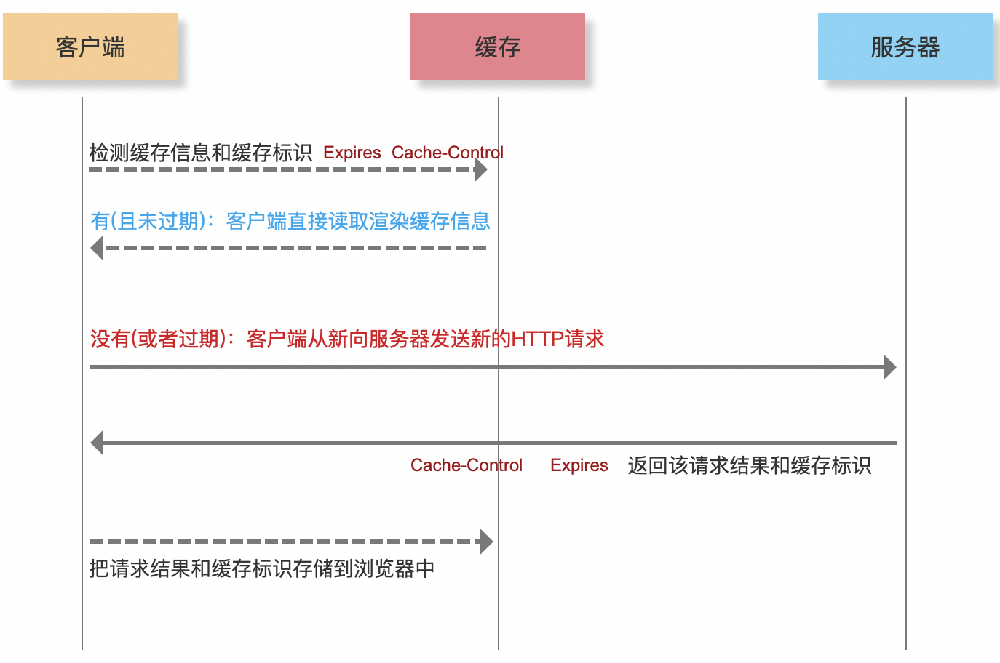
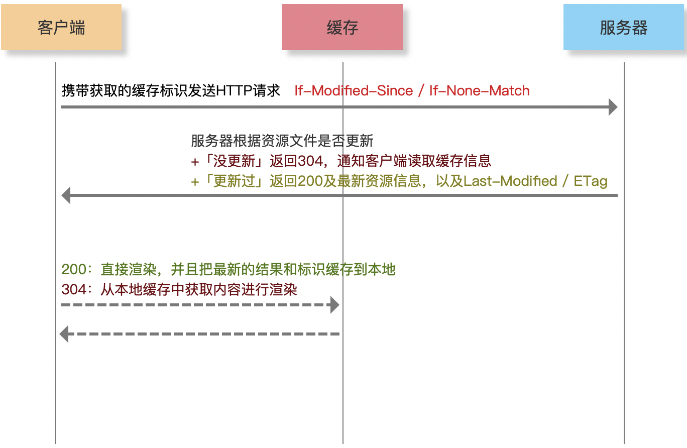
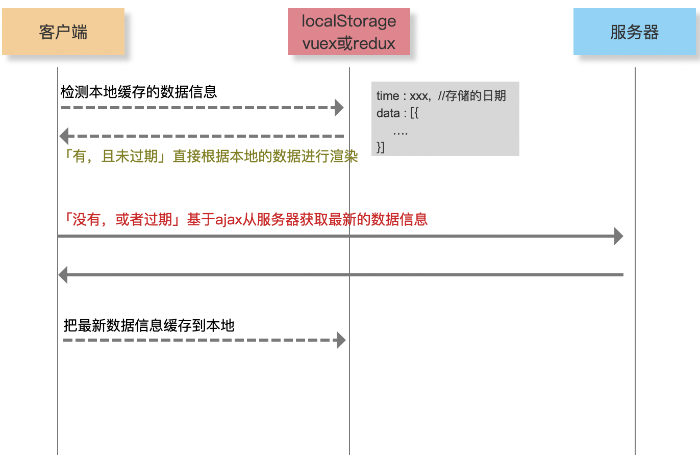
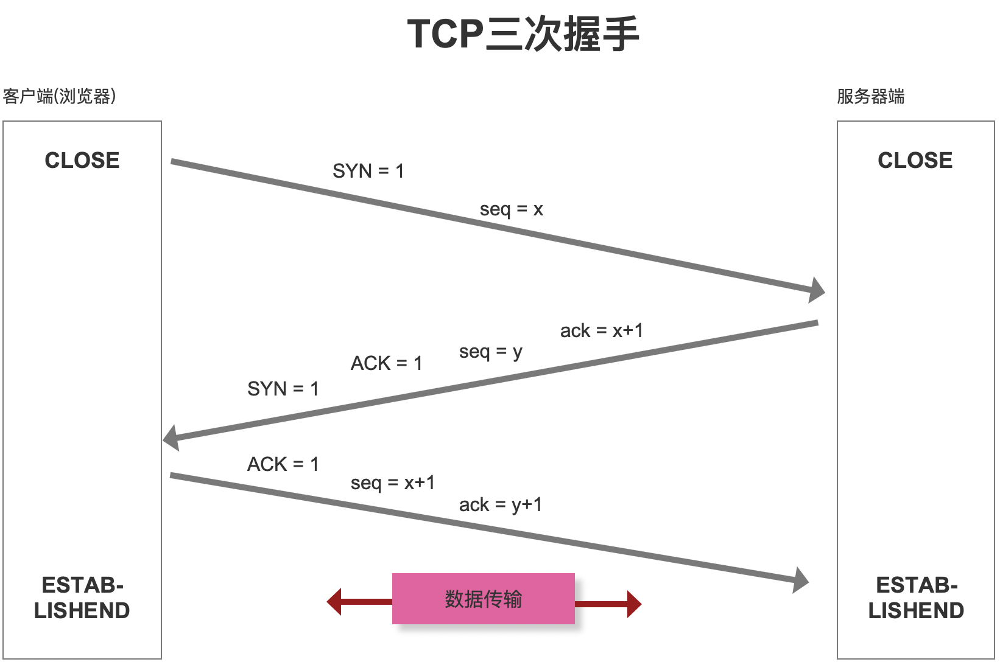
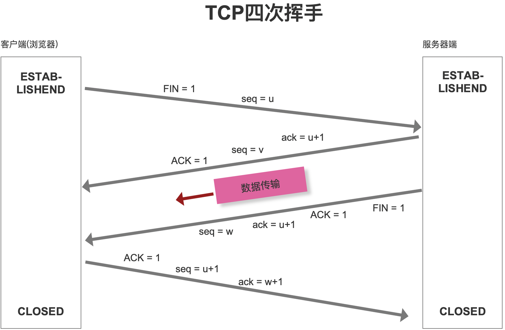
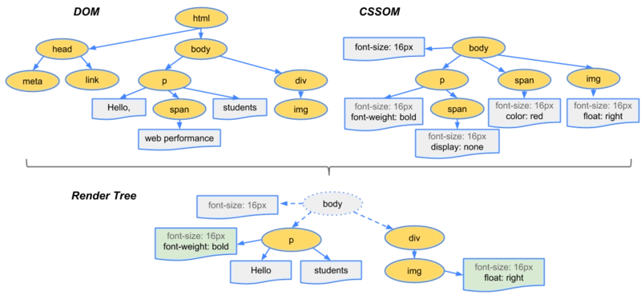
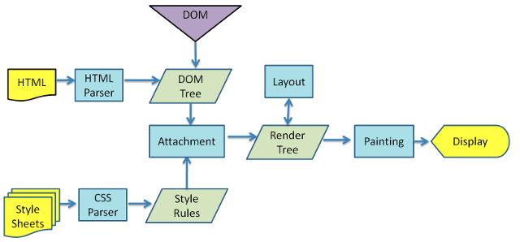
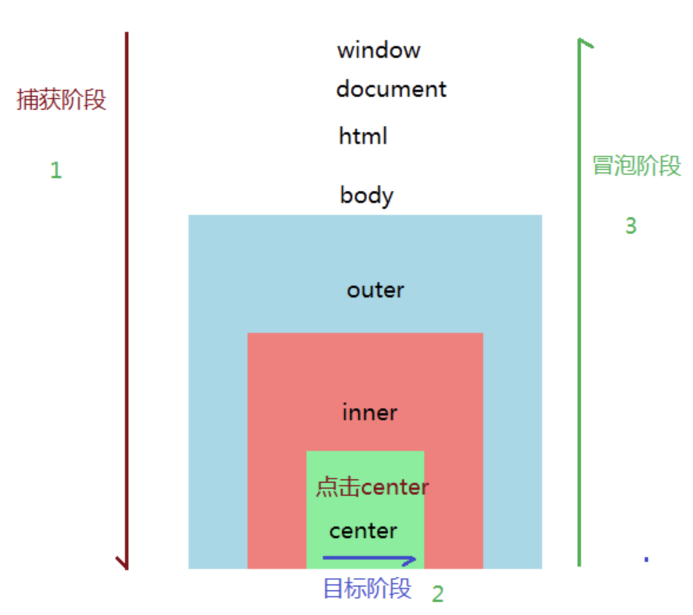

# 前端性能优化

## 1、前端性能优化核心处理思想：CRP

首先了解一下什么是CRP：

>CRP：critical/ rendering / path

CRP 中文称作关键渲染路径，找到[MDN](https://developer.mozilla.org/zh-CN/)对它的解释如下：

[关键渲染路径](https://developer.mozilla.org/zh-CN/docs/Web/Performance/Critical_rendering_path)是浏览器将 HTML，CSS 和 JavaScript 转换为屏幕上的像素所经历的步骤序列。优化关键渲染路径可提高渲染性能。关键渲染路径包含了 [文档对象模型](https://developer.mozilla.org/zh-CN/docs/Web/API/Document_Object_Model) (DOM)，[CSS 对象模型](https://developer.mozilla.org/zh-CN/docs/Web/API/CSS_Object_Model) (CSSOM)，渲染树和布局。

### 优化CRP

提升页面加载速度需要通过被加载资源的优先级、控制它们加载的顺序和减小这些资源的体积。

性能提示包含：

    1）通过异步重要资源的下载来减小请求数量，
    2）优化必须的请求数量和每个请求的文件体积，
    3）通过区分关键资源的优先级来优化被加载关键资源的顺序，来缩短关键路径长度。

具体的解释说明可以去[MDN](https://developer.mozilla.org/zh-CN/docs/Web/Performance/Critical_rendering_path)查看。说到底，就是了解浏览器渲染的每个环节，并且针对每个环节做优化！！！

## 2、HTTP网络层面的4种核心优化方案

* 资源和数据的缓存处理
* 减少HTTP的请求次数和大小
* DNS预解析处理
* 有关图片的优化处理

### 从输入URL地址到看到页面，中间都经历了啥？

#### 第一步：URL解析

#### 第二步：缓存检查

==强缓存 Expires / Cache-Control==

浏览器对于强缓存的处理：根据第一次请求资源时返回的响应头来确定的

* Expires：缓存过期时间，用来指定资源到期的时间（HTTP/1.0）

* Cache-Control：cache-control: max-age=2592000第一次拿到资源后的2592000秒内（30天），再次发送请求，读取缓存中的信息（HTTP/1.1）

两者同时存在的话，Cache-Control优先级高于Expires



==协商缓存 Last-Modified / ETag==

协商缓存就是强制缓存失效后，浏览器携带缓存标识向服务器发起请求，由服务器根据缓存标识决定是否使用缓存的过程



==数据缓存==



扩展：本地存储、服务器存储、Token校验机制、单点登录….

#### 第三步：DNS解析

每一次DNS解析时间预计在20~120毫秒

* 减少DNS请求次数
* DNS预获取（DNS Prefetch）

```html
<meta http-equiv="x-dns-prefetch-control" content="on">
<link rel="dns-prefetch" href="//static.baidu.com"/>
<link rel="dns-prefetch" href="//misc.baidu.com"/>
<link rel="dns-prefetch" href="//img10.baidu.com"/>
<link rel="dns-prefetch" href="//d.3.cn"/>
<link rel="dns-prefetch" href="//d.jd.com"/>
```

扩展：多服务器、分资源部署的好处；DNS解析机制；CDN加速原理！！

#### 第四步：TCP三次握手



扩展：UDP和TCP的区别？HTTPS和HTTP的区别？HTTP2.0和1.0的区别？

#### 第五步：数据传输

==优化方案==

1、减少HTTP请求次数和大小

* 资源文件合并处理压缩（webpack）
* 服务器端一定要开启GZIP压缩（一般能压缩60%左右）
* 大批量数据分批次请求（例如：下拉刷新或者分页）

2、图片资源的优化

* 字体图标 或者 SVG
* 雪碧图 CSS-Sprit
* 图片的BASE64
* 图片延迟加载
  * onscroll滚动处理方案
  * IntersectionObserver

扩展：HTTP报文、各响应状态码的意义、webpack打包优化……

#### 第六步：TCP四次挥手

==Connection: keep-alive==



扩展：为什么连接的时候是三次握手，关闭的时候却是四次握手？

#### 第七步：页面渲染

* DOM TREE 结构树
* CSSOM TREE 样式树
* RENDER TREE 渲染树
* LAYOUT 布局/排列
* LAYERING 分层
* PAINTING 绘制/渲染





==优化方案==

1. 标签语义化和避免深层次嵌套
2. CSS选择器渲染是从右到左
3. 尽早尽快地把CSS下载到客户端
   * style
   * link
   * \@import
   * 放到顶部
4. 避免阻塞的JS加载
   * async
   * defer
   * 放到底部


扩展：同步异步编程；DOMContentLoaded 和 Load 事件触发环节！！

## 3、DOM层面的4种核心优化方案

* 减少重排和重绘
* 使用事件委托
* 函数的防抖和节流
* requestAnimationFrame

### 减少重排和重绘

* 重绘：元素样式的改变(但宽高、大小、位置等不变)，如 outline、visibility、color、background-color…

* 重排：元素的大小或者位置发生了变化(当页面布局和几何信息发生变化的时候)，触发了重新布局，导致渲染树重新计算布局！如 添加或删除可见的DOM元素、元素位置发生变化、元素尺寸发生变化、内容发生变化、页面一开始渲染的时候、窗口尺寸变化…

***重排一定会触发重绘，而重绘不一定会重排***

* 放弃直接对DOM的操作「使用vue/react框架」
* 读写分离和浏览器渲染队列
  * 渲染队列的实战应用
* 元素批量修改
  * 文档碎片
  * 模板字符串拼接「绑定事件丢失 -> 事件委托」
* 动画运用到脱离文档流的元素上
* 开启CSS3硬件加速，修改样式基于transform等

### 使用事件委托



### 函数的防抖和节流

```js
(function () {
  const clearTimer = function clearTimer(timer) {
    if (timer) {
      clearTimeout(timer);
    }
    return null;
  };

  const debounce = function debounce(func, wait, immediate) {
    if (typeof func !== 'function') throw new TypeError(`func must be an function`);
    if (typeof wait === 'boolean') immediate = wait;
    if (typeof wait !== 'number') wait = 500;
    if (typeof immediate !== 'boolean') immediate = false;
    let timer = null;
    return function operate(...params) {
      let now = !timer && immediate,
        result;
      timer = clearTimer(timer);
      timer = setTimeout(() => {
        timer = clearTimer(timer);
        if (!immediate) func.call(this, ...params);
      }, wait);
      if (now) result = func.call(this, ...params);
      return result;
    };
  };

  const throttle = function throttle(func, wait) {
    if (typeof func !== 'function') throw new TypeError(`func must be an function`);
    if (typeof wait !== 'number') wait = 500;
    let timer = null,
      previous = 0;
    return function operate(...params) {
      let remaining = wait - (+new Date() - previous),
        result;
      if (remaining <= 0) {
        timer = clearTimer(timer);
        result = func.call(this, ...params);
        previous = +new Date();
        return result;
      }
      if (!timer) {
        timer = setTimeout(() => {
          timer = clearTimer(timer);
          func.call(this, ...params);
          previous = +new Date();
        }, remaining);
      }
    };
  };

  /* 暴露API */
  let utils = {
    debounce,
    throttle
  };
  if (typeof define === "function" && define.amd) define("utils", [], () => utils);
  if (typeof module === "object" && typeof module.exports === "object") module.exports = utils;
  if (typeof window !== 'undefined') window.utils = utils;
})();
```

### requestAnimationFrame && cancelAnimationFrame

* requestAnimationFrame会把每一帧中的所有DOM操作集中起来，在一次重绘或回流中就完成，并且重绘或回流的时间间隔紧紧跟随浏览器的刷新频率

* 在隐藏或不可见的元素中，requestAnimationFrame将不会进行重绘或回流，这当然就意味着更少的CPU、GPU和内存使用量

* requestAnimationFrame是由浏览器专门为动画提供的API，在运行时浏览器会自动优化方法的调用，并且如果页面不是激活状态下的话，动画会自动暂停，有效节省了CPU开销

## 4、Vue框架和代码层面的多种优化方案

* UI组件库的按需导入
* 合理运用路由懒加载
* 使用KeepAlive缓存组件
* 使用Non-reactive data非响应式数据
* 超长列表和无限列表性能优化
