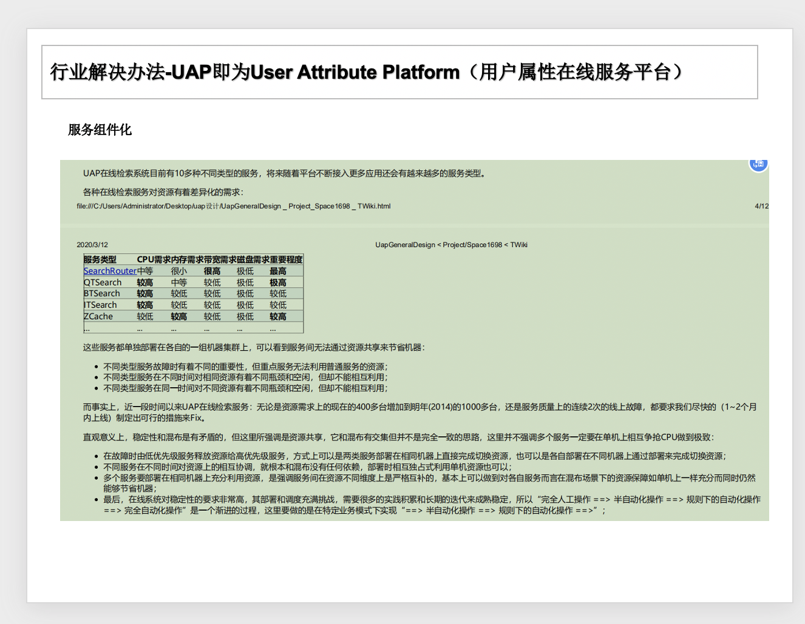
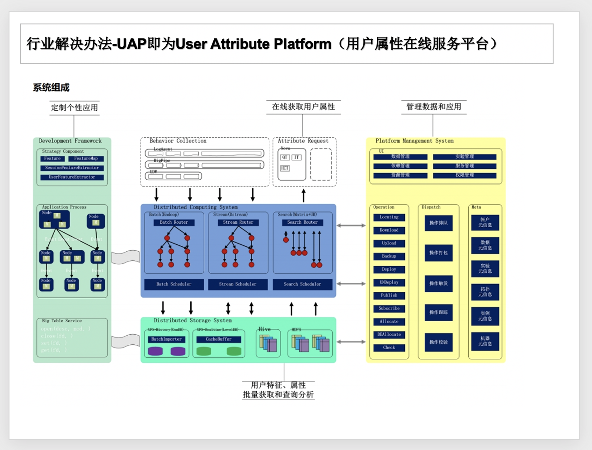
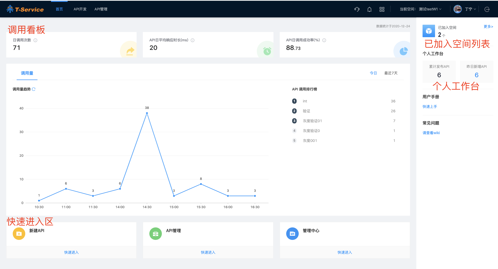
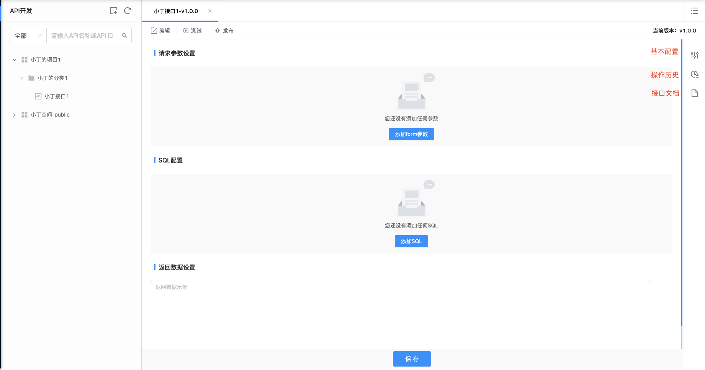
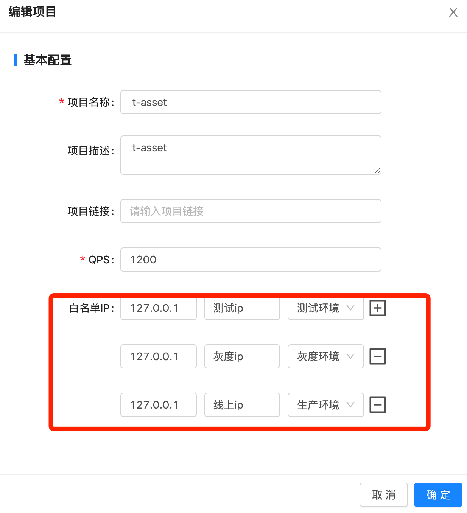

# tService

## 背景

### 数据服务模式

### 行业解决方案

#### 阿里OneService

* DWSOA：一个需求一个接口，编码实现接口，接口数量5000/年。开发效率低，投入成本高，扩展性差。

* OpenAPI：一类需求一个接口，配置实现接口，接口数量200/年。相比上一种方式，这种方式有效收敛了数量。

* SmartDQ：所有需求一个接口，配置实现接口，接口数量1，缺点是服务形式不够丰富，只能满足简单的查询服务需求（毕竟SQL并不能解决复杂的业务逻辑）。SmartDQ通过在OpenAPI的基础上，再抽象一层，用DSL（领域专用语言）来描述取数需求，新做一套DSL必然有学习成本，因此采用标准的SQL语法。
* OneService：提供多种服务类型来满足用户需求。

A、OneService-SmartDQ：通过SQL语法提供简单的查询服务需求。

B、OneService-Lego：采用插件方式满足个性化需求，为了避免插件之间相互影响，我们将插件做成微服务，使用Docker做隔离。Lego可以采用轻量级的Node.JS技术栈实现，适合处理高并发、低延迟的IO密集型场景。

C、OneService-iPush：主要提供websocket和long polling两种方式，其应用场景主要是商家端实时直播。比如双11，此时使用websocket方式可以有效缓解服务器压力，给用户带来最实时的体验。

D、OneService-uTiming：主要提供即时任务和定时任务两种模式，其主要应用场景是满足用户运行大数据量任务的需求。

==最佳实践：==

* 资源分配：复杂的计算逻辑可以提前计算；Get接口只返回一条记录，查询代价小响应时间短，List接口返回多条记录，查询时间相对较长，可以设计Get线程池和List线程池两个独立的线程池避免Get接口和List接口相互影响；查询可以在引擎层自动进行拆分查询，然后再把查询结果进行合并。

* 缓存优化：元数据缓存、模型缓存、结果缓存。

* 查询能力：由于离线数据和实时数据存放在不同地方，并且离线数据最准确，需要优先使用离线数据，如果离线数据还未产出，则改用实时数据，这就是要对离线和实时进行合并查询；能采用推送的，就不采用轮询，因为轮询对服务器压力大。

* 限流、降级：限流就是直接降到0，降级就是只将存在问题的资源置为失效状态。

#### 百度UAP

## 架构设计

### 整体架构

### 功能架构

### 技术架构

* confcenter：主要做api，网关和appid的接口的属性和db的资源配置。

* server group：主要针对不同的appid的接口属性（java，brpc）和数据源的的资源隔离。以及服务端的接口内容级别的鉴权和限流。

* apisix：基于apisix的网关层主要接口网关的限流和鉴权。

* dashboard：主要对目前资源情况做监控预警以及手动执行策略。

### 亮点一、通用服务接口配置

### 亮点二、打通网关和服务端鉴权机制

==双重限流机制实现网关前置限流==

### 亮点三、动态资源调整

亮点四、 接口API，多角色使用、多版本研发、多环境发布等管理

## T-Service平台用户手册

### 平台简介

随着数据对于业务赋能的展开，业务系统调用的数据服务往往要经历数据开发、接口开发等多个环节和角色，即便准备好的数据，根据请求和返回参数的不同，每一个新的API都需要额外的开发量，平均一个接口的开发周期在1周左右，对于数据赋能和验证的效率是极低的。所以，为了实现数据服务的快速搭建，提高数据流动和使用的效率，搭建统一的数据服务平台，用于提高API服务开发的整体效率就变得尤其重要，T-Service平台即是在该背景下应运而生。

### 整体框架

T-Service的整体框架如上图，各个模块的简介如下（详情请参见下面各模块的具体介绍）:

    1、首页：点击进入首页包括调用看板、已加入的空间列表、个人工作台、快速开始区等。

    2、API开发：点击进入API开发模块，进行配置、测试、发布API。

    3、API管理：空间内已发布的所有API的列表查看。

    4、问题反馈：如您对平台的各个模块需要反馈，请点击问题反馈告知平台。

    5、消息中心：空间用户对于接口进行了哪些操作，可在这里进行查看。

    6、管理中心：对空间、项目和数据源的增改查操作在这里。

    7、切换空间：点击可以切换所在的空间。

### 准备工作

#### 了解平台权限体系

权限模型在T-Service上的应用：

（1）租户与空间概念：同时为了保证平台在整个公司可以很好的适用于各事业部，引入租户的概念，目标是保证各租户在数据层面有自己的独立空间，实现资源隔离。

这里的资源主要包含三种：1 数据资源  2 队列资源  3 应用资源

（2）角色权限

Service平台角色和权限点设置：

<table class="relative-table wrapped confluenceTable"><colgroup><col style="width: 11.512%;" /><col style="width: 18.5567%;" /><col style="width: 10.2234%;" /><col style="width: 12.8007%;" /><col style="width: 11.7698%;" /><col style="width: 12.2852%;" /></colgroup><thead><tr><th class="confluenceTh" colspan="1">功能维度</th><th class="confluenceTh" style="text-align: left;">
功能\角色
</th><th class="confluenceTh" style="text-align: left;">
项目-viewer
</th><th class="confluenceTh" style="text-align: left;">
项目-developer
</th><th class="confluenceTh" style="text-align: left;">
项目-owner
</th><th class="confluenceTh" colspan="1">空间-owner</th></tr></thead><tbody><tr><td class="confluenceTd" rowspan="4">接口操作权限</td><td class="confluenceTd" style="text-align: left;">查看项目公开接口列表</td><td class="confluenceTd" style="text-align: left;">✔️</td><td class="confluenceTd" style="text-align: left;">✔️</td><td class="confluenceTd" style="text-align: left;">✔️</td><td class="confluenceTd" colspan="1">✔️</td></tr><tr><td class="confluenceTd" style="text-align: left;" colspan="1">查看项目内接口</td><td class="confluenceTd" style="text-align: left;" colspan="1">✔️</td><td class="confluenceTd" style="text-align: left;" colspan="1">✔️</td><td class="confluenceTd" style="text-align: left;" colspan="1">✔️</td><td class="confluenceTd" colspan="1">✔️</td></tr><tr><td class="confluenceTd" style="text-align: left;">新增/编辑项目内接口</td><td class="confluenceTd" style="text-align: left;"> </td><td class="confluenceTd" style="text-align: left;">✔️</td><td class="confluenceTd" style="text-align: left;">✔️</td><td class="confluenceTd" colspan="1">✔️</td></tr><tr><td class="confluenceTd" style="text-align: left;" colspan="1">为项目（应用）授权接口</td><td class="confluenceTd" style="text-align: left;" colspan="1"> </td><td class="confluenceTd" style="text-align: left;" colspan="1">✔️</td><td class="confluenceTd" style="text-align: left;" colspan="1">✔️</td><td class="confluenceTd" colspan="1">✔️</td></tr><tr><td class="confluenceTd" rowspan="3">成员操作权限</td><td class="confluenceTd" colspan="1">新增/编辑项目内用户权限</td><td class="confluenceTd" colspan="1"> </td><td class="confluenceTd" colspan="1"> </td><td class="confluenceTd" colspan="1">✔️</td><td class="confluenceTd" colspan="1">✔️</td></tr><tr><td class="confluenceTd" colspan="1">新增空间用户</td><td class="confluenceTd" colspan="1"> </td><td class="confluenceTd" colspan="1"> </td><td class="confluenceTd" colspan="1"> </td><td class="confluenceTd" colspan="1">✔️</td></tr><tr><td class="confluenceTd" colspan="1">编辑空间内用户权限，用户所属项目</td><td class="confluenceTd" colspan="1"> </td><td class="confluenceTd" colspan="1"> </td><td class="confluenceTd" colspan="1"> </td><td class="confluenceTd" colspan="1">✔️</td></tr><tr><td class="confluenceTd" rowspan="4">项目/应用操作权限</td><td class="confluenceTd" colspan="1">新增项目（应用）</td><td class="confluenceTd" colspan="1"> </td><td class="confluenceTd" colspan="1">✔️</td><td class="confluenceTd" colspan="1">✔️</td><td class="confluenceTd" colspan="1">✔️</td></tr><tr><td class="confluenceTd" colspan="1">查看项目列表（应用）</td><td class="confluenceTd" colspan="1"> </td><td class="confluenceTd" colspan="1">✔️</td><td class="confluenceTd" colspan="1">✔️</td><td class="confluenceTd" colspan="1">✔️</td></tr><tr><td class="confluenceTd" colspan="1">编辑项目（应用）</td><td class="confluenceTd" colspan="1"> </td><td class="confluenceTd" colspan="1"> </td><td class="confluenceTd" colspan="1">✔️</td><td class="confluenceTd" colspan="1">✔️</td></tr><tr><td class="confluenceTd" colspan="1">删除项目（应用）</td><td class="confluenceTd" colspan="1"> </td><td class="confluenceTd" colspan="1"> </td><td class="confluenceTd" colspan="1"> </td><td class="confluenceTd" colspan="1">✔️</td></tr><tr><td class="confluenceTd" colspan="1">数据源操作权限</td><td class="confluenceTd" colspan="1">新增/编辑数据源</td><td class="confluenceTd" colspan="1"> </td><td class="confluenceTd" colspan="1">✔️</td><td class="confluenceTd" colspan="1">✔️</td><td class="confluenceTd" colspan="1">✔️</td></tr></tbody></table>

#### 创建空间

用户需要为自己的团队创建空间，需要联系平台超管创建空间，并指定该空间的owner作为未来此空间的维护者。

拥有自己团队的空间之后，空间owner可以在管理中心进行配置管理。

### 各模块说明文档

#### 首页

1、调用看板：通过调用看板可以看到今日以及最近7天的调用数据。

2、快速开始区

    （1）新建API：点击进入API 开发模块

    （2）API管理：点击进入API管理模块

    （3）管理中心：对空间 、项目、数据源进行配置管理

3、已加入空间列表：点击打开侧边栏，显示用户已经加入的空间；若用户想加入其他空间，点击「查看其他空间」按钮，可直接点击各空间的管理员老师，与老师联系加入该空间。

4、个人工作台：可查看该空间的API发布数量，可以查看用户帮助文档和常见问题。

#### API开发

用户第一次登陆平台会默认进入公共空间，用户可在这里进行API配置了解，若需要其他团队空间的权限，请在首页空间列表「查看其他空间」点击联系管理员老师把您加入空间。

任何空间下都有一个public项目，用户可以在此项目下配置空间下的公共接口。

左侧目录树结构：

（1）如图所示：「项目」下设「分类」，「分类」下设「接口」。

（2）新建操作：用户可「新建项目」、「新建分类」、「添加API」

（3）对项目的操作：右键点击可支持对项目进行操作。

a、查看项目下API列表：

* 可支持对项目下所有API进行搜索查看，调整分类以及添加授权app，可支持复制、编辑api，可支持添加API

（4）对分类的操作：右键点击可支持对分类进行操作。

a、查看分类下API列表：

* 可支持对分类下所有API进行搜索查看，调整分类以及添加授权app，可支持复制、编辑api，可支持添加API

（5）对API的操作

右键点击可支持对API进行操作。支持复制、编辑和主动授权。

进行API开发：

API开发区，tab以API名称+版本号命名。右侧icon点击后可支持侧边栏查看「基本配置」、「操作历史」以及「接口文档」。

1、编辑：支持对请求参数进行设置、SQL配置。

2、测试：对于编辑已保存的API进行测试

3、发布：可发布到测试环境、灰度环境以及线上环境。

版本管理：

点击左侧树状结构的接口，显示API不同版本环境下的列表，支持对各版本环境的查看配置操作。支持新增复制版本。

#### API管理

点击header的API管理进入API管理模块。列表展示空间下配置的所有API列表，支持搜索，查看和新建API。

#### 管理中心

点击header的管理中心icon进入管理中心模块，对空间、项目和数据源的增改查操作在这里。

空间管理：空间owner可以对空间进行管理

    （1）基本配置：进行编辑

    （2）成员管理：支持新增、编辑空间成员。

项目管理：

项目可以理解为多个API的集合, 一个项目可以根据场景进行分类.

***一个项目下的api是否能被访问需要白名单的支持. 否则会被网关拦截***

    （1）基本配置：项目owner进行编辑

    （2）成员管理：项目owner支持新增、编辑项目成员。

    （3）项目发布的API list：支持查看

    （4）项目可调用的API list：支持查看
    
    （5) 白名单配置：需要将后端集群的出口IP配置到响应的环境上, 出口IP 的获得方式请咨询业务方SRE

数据源管理：

数据源管理支持：MySQL、Holo、ADB的数据源新增

* schema: 是hologress特殊配置项, 可选

* host: hologress的阿里云esc地址, 建议使用vpc域名, 内网直连

申请的Holo集群默认会与tservice集群打通无需单独设置白名单

==提示:==

    1) 生产和测试mysql可以配置为一个

    2) 请确保业务 mysql 添加tservice后端集群IP到白名单中

    IP列表

    10.43.80.56
    10.43.80.57
    10.43.80.58
    10.43.80.59
    10.43.80.139
    10.43.80.140
    10.43.80.141

消息中心：

点击header的消息中心进入消息中心模块。消息中心可支持查看：空间用户对于接口进行了哪些操作。

### 问题反馈

点击header的问题反馈进入问题反馈模块。请把您的反馈建议告诉平台。

## 整体流程

## 能力矩阵

Api生命周期管理：

    接入: Api的归属 - 以空间 / 项目 层次进行系统接入, 保证API与组织架构绑定
    资源: Api的养料 - Api在运行时依赖的硬件, 软件资源以及资源之间的调度
    定义: Api模型 - Api元信息, 数据组装形式
    发布: Api需要运行的的网络环境
    监控: Api运行时的健康状况
    管控: Api运行时对资源的占用边界控制
    大盘: Api的使用情况
    归档: Api运行后的数据轨迹处置动作
