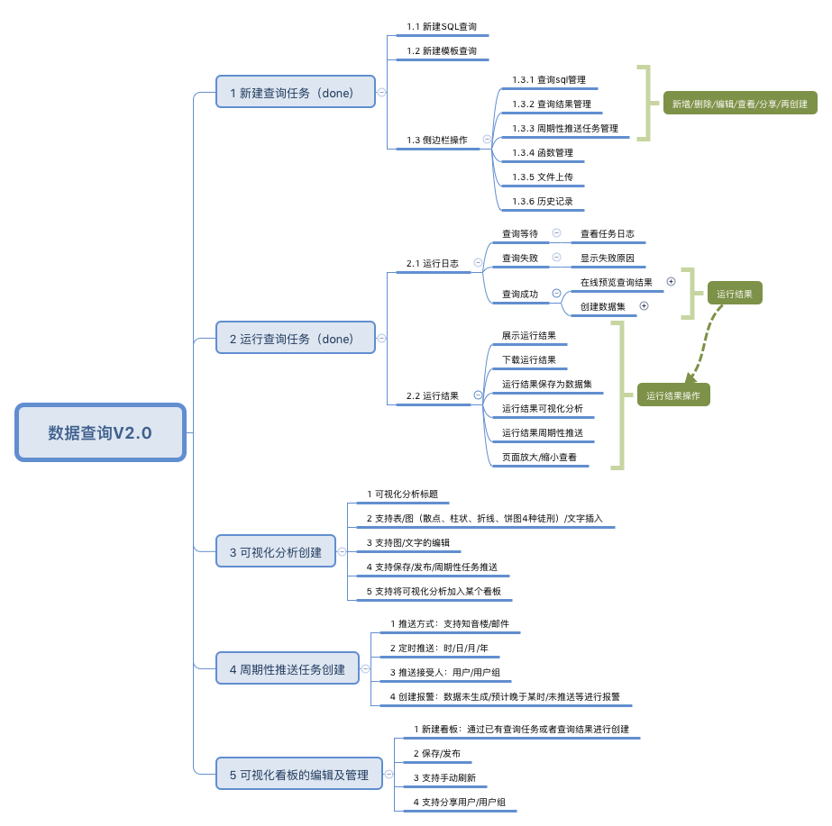

# 数据查询

## 背景

基于数据查询1.0自有用户已达400+，整体使用用户已达600+，用户对于查询的稳定性提出了更高的要求，同时，sql代码查询对于用户的使用门槛较高，用户无sql查询的需求也越来越强，本次sql查询即是为了实现这个目标，满足用户无sql查询和稳定性查询的需求。同时，通过过往用户调研，现有的下载由于支持50w的下载条目，导致使用流程不够友好，推送不支持月、周的定期推送等，而现有的查询平台由于底层的实现逻辑，不能支持以上优化，故整体针对数据查询进行升级，以满足用户更好的体验。

## 项目目标

数据查询上线后，达成以下两个关键目标：

    2.1 用户体验优化：查询、下载和推送的全流程优化，满足用户的使用体验，获得满意度得分的提升；
    2.2 使用门槛降低：通过支持模版sql拼接，降低用户的使用门槛，同时基于未来数仓的模型建设，可以很好的满足模型查询；
    2.3 支持分析闭环流程：实现查询结果的一键分析，减少大量数据下载场景，降低下载的成本消耗。

## 功能架构

