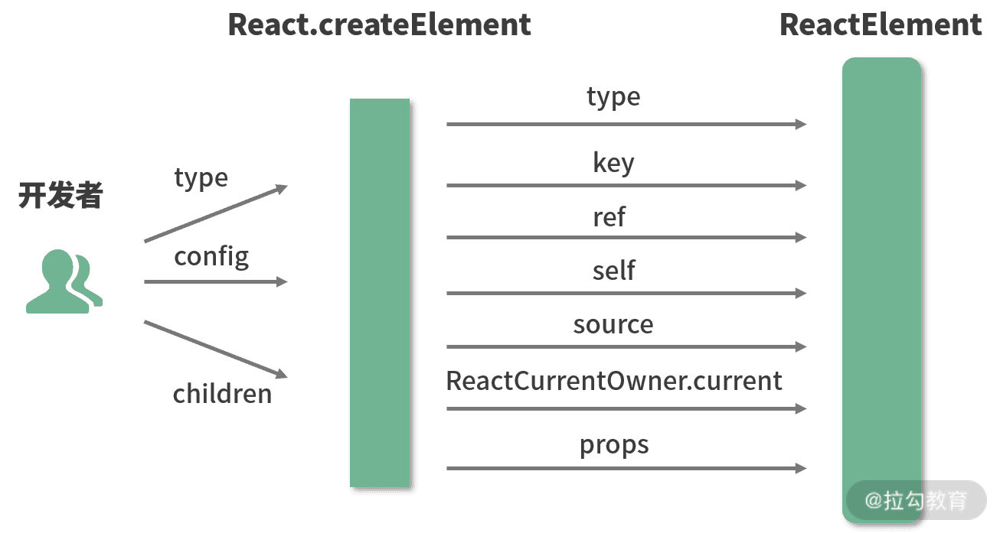
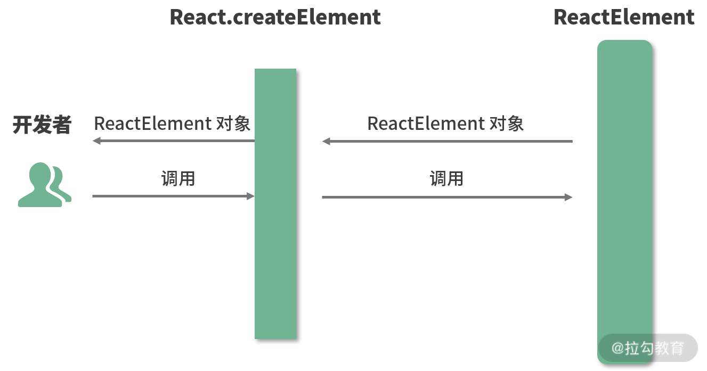
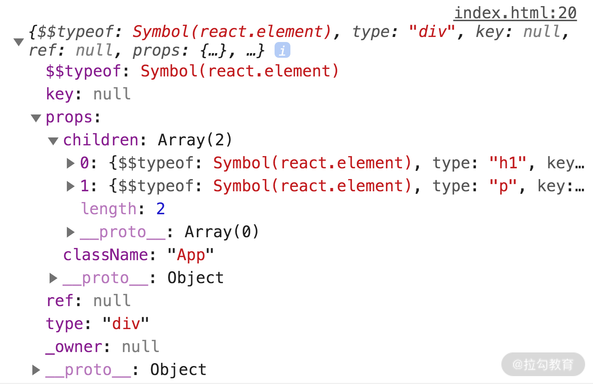

# React 问题

1、JSX 的本质是什么，它和 JS 之间到底是什么关系？

JSX 的本质：JavaScript 的语法扩展
JSX 是 JavaScript 的一种语法扩展，它和模板语言很接近，但是它充分具备 JavaScript 的能力。
JSX 语法是如何在 JavaScript 中生效的：认识 Babel
JSX 会被编译为 React.createElement()， React.createElement() 将返回一个叫作“React Element”的 JS 对象。

什么是 Babel 呢？
Babel 是一个工具链，主要用于将 ECMAScript 2015+ 版本的代码转换为向后兼容的 JavaScript 语法，以便能够运行在当前和旧版本的浏览器或其他环境中。
类似的，Babel 也具备将 JSX 语法转换为 JavaScript 代码的能力。
JSX 的本质是React.createElement这个 JavaScript 调用的语法糖

2、为什么要用 JSX？不用会有什么后果？

JSX 语法糖允许前端开发者使用我们最为熟悉的类 HTML 标签语法来创建虚拟 DOM，在降低学习成本的同时，也提升了研发效率与研发体验。

3、JSX 背后的功能模块是什么，这个功能模块都做了哪些事情？

createElement 源码:

```js
// React的创建元素方法
// type：用于标识节点的类型。它可以是类似“h1”“div”这样的标准 HTML 标签字符串，也可以是 React 组件类型或 React fragment 类型。
// config：以对象形式传入，组件所有的属性都会以键值对的形式存储在 config 对象中。
// children：以对象形式传入，它记录的是组件标签之间嵌套的内容，也就是所谓的“子节点”“子元素”。
export function createElement(type, config, children) {
  // propName 变量用于储存后面需要用到的元素属性
  let propName;
  // props 变量用于储存元素属性的键值对集合
  const props = {};
  // key、ref、self、source 均为 React 元素的属性，此处不必深究
  let key = null;
  let ref = null;
  let self = null;
  let source = null;

  // config 对象中存储的是元素的属性
  if (config != null) {
    // 进来之后做的第一件事，是依次对 ref、key、self 和 source 属性赋值
    if (hasValidRef(config)) {
      ref = config.ref;
    }
    // 此处将 key 值字符串化
    if (hasValidKey(config)) {
      key = '' + config.key;
    }
    self = config.__self === undefined ? null : config.__self;
    source = config.__source === undefined ? null : config.__source;

    // 接着就是要把 config 里面的属性都一个一个挪到 props 这个之前声明好的对象里面
    for (propName in config) {
      if (
        // 筛选出可以提进 props 对象里的属性
        hasOwnProperty.call(config, propName) &&
        !RESERVED_PROPS.hasOwnProperty(propName)
      ) {
        props[propName] = config[propName];
      }
    }
  }

  // childrenLength 指的是当前元素的子元素的个数，减去的 2 是 type 和 config 两个参数占用的长度
  const childrenLength = arguments.length - 2;
  // 如果抛去type和config，就只剩下一个参数，一般意味着文本节点出现了
  if (childrenLength === 1) {
    // 直接把这个参数的值赋给props.children
    props.children = children;
    // 处理嵌套多个子元素的情况
  } else if (childrenLength > 1) {
    // 声明一个子元素数组
    const childArray = Array(childrenLength);
    // 把子元素推进数组里
    for (let i = 0; i < childrenLength; i++) {
      childArray[i] = arguments[i + 2];
    }
    // 最后把这个数组赋值给props.children
    props.children = childArray;
  }

  // 处理 defaultProps
  if (type && type.defaultProps) {
    const defaultProps = type.defaultProps;
    for (propName in defaultProps) {
      if (props[propName] === undefined) {
        props[propName] = defaultProps[propName];
      }
    }
  }

  // 最后返回一个调用ReactElement执行方法，并传入刚才处理过的参数
  return ReactElement(
    type,
    key,
    ref,
    self,
    source,
    ReactCurrentOwner.current,
    props,
  );
}
```

举个例子：

```jsx
<ul className="list">
  <li key="1">1</li>
  <li key="2">2</li>
</ul>
```

上述编译成如下：

```js
React.createElement("ul", {
  // 传入属性键值对
  className: "list"
  // 从第三个入参开始往后，传入的参数都是 children
}, React.createElement("li", {
  key: "1"
}, "1"), React.createElement("li", {
  key: "2"
}, "2"));
```

`createElement` 在逻辑层面的任务流转图:


整个过程图：



ReactElement 源码：

```js
const ReactElement = function (type, key, ref, self, source, owner, props) {
  const element = {
    // REACT_ELEMENT_TYPE是一个常量，用来标识该对象是一个ReactElement
    $$typeof: REACT_ELEMENT_TYPE,
    // 内置属性赋值
    type: type,
    key: key,
    ref: ref,
    props: props,
    // 记录创造该元素的组件
    _owner: owner,
  };
  // 
  if (__DEV__) {
    // 这里是一些针对 __DEV__ 环境下的处理，对于大家理解主要逻辑意义不大，此处我直接省略掉，以免混淆视听
  }
  return element;
};
```

`ReactElement` 其实只做了一件事情，那就是“创建”，说得更精确一点，是“组装”：`ReactElement` 把传入的参数按照一定的规范，“组装”进了 `element` 对象里，并把它返回给了 `React.createElement`，最终 `React.createElement` 又把它交回到了开发者手中。整个过程如下图所示：



```jsx
const AppJSX = (<div className="App">
  <h1 className="title">I am the title</h1>
  <p className="content">I am the content</p>
</div>)

console.log(AppJSX)
```

通过上述代码，可以在浏览器控制台看到输出：



这个 ReactElement 对象实例，本质上是以 JavaScript 对象形式存在的对 DOM 的描述，也就是老生常谈的“虚拟 DOM”（准确地说，是虚拟 DOM 中的一个节点。）

既然是“虚拟 DOM”，那就意味着和渲染到页面上的真实 DOM 之间还有一些距离，这个“距离”，就是由大家喜闻乐见的 ReactDOM.render 方法来填补的。

```js
ReactDOM.render(
  // 需要渲染的元素（ReactElement）
  element, 
  // 元素挂载的目标容器（一个真实DOM）
  container,
  // 回调函数，可选参数，可以用来处理渲染结束后的逻辑
  [callback]
)
```
